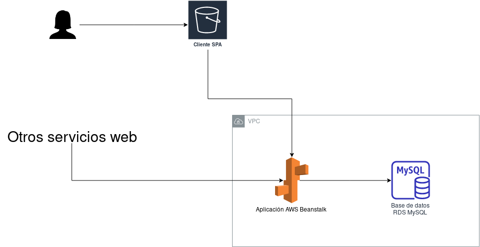
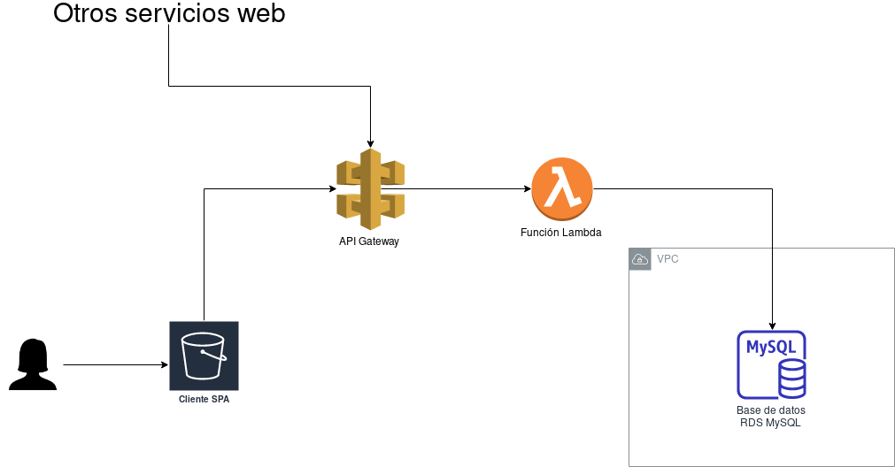

# API REST web de banca online
## Descripción
API REST de ejemplo para simular un sencillo servicio de banca online. El objetivo es utilizar una aplicación de muestra para su despliegue en un **servidor web** (con AWS Beanstalk) o de manera **serverless** (con AWS Lambda). Por sencillez se deja sin implementar todo el tema de autenticación.

Se desarrollará también un cliente de una sola página (SPA) para interactuar con la API. Dicho cliente está disponible en https://github.com/pedroprieto/cliente-bank-app

El esquema de la solución desplegada en un **servidor web** con **AWS Beanstalk** sería el siguiente:




El esquema de la solución desplegada de manera **serverless** con **AWS Lambda** sería el siguiente:



## Instalación
1. Clonar repositorio
2. Acceder a la carpeta del repositorio
    ```bash
    cd api-bank-app
    ```
3. Instalar dependencias de .NET
    ```bash
    dotnet restore
    ```
4. Instalar base de datos MySQL en el sistema. Anotar los parámetros de conexión
5. Acceder al directorio del proyecto
    ```bash
    cd api-bank-app
    ```
6. Actualizar los datos de conexión a la base de datos local en archivo `api-bank-app/appsettings.json`
    ```json
    "ConnectionStrings": {
        "BankDatabase": "server=localhost;port=3306;user=root;password=;database=bank"
    },
    ```
7. Actualizar base de datos a través de Entity Framework
    ```bash
    dotnet ef database update
    ```
8. Lanzar aplicación
    ```bash
    dotnet run
    ```
9. Acceder a la API en `http://localhost:5000/api/clients`

## Instrucciones de despliegue
### AWS ElasticBeanstalk
1. Crear un usuario en AWS IAM para que permita el acceso mediante CLI. Para desplegar en BeanStalk será necesario concederle los siguientes permisos:
    - `AWSElasticBeanstalkFullAccess`
    - `IAMFullAccess`
2. Configurar en el equipo local las [credenciales de acceso a AWS](https://docs.aws.amazon.com/es_es/cli/latest/userguide/cli-chap-configure.html) con los datos del usuario creado
3. Instalar proyecto y dependencias de .NET
4. Crear una nueva aplicación en ElasticBeanstalk en la consola de AWS
5. Crear un entorno .NET dentro de la aplicación de ElasticBeanstalk. Elegir una máquina `t2.micro`
6. Crear una base de datos en AWS RDS de tipo MySQL. Para la práctica es recomendable utilizar MariaDB y seleccionar una instancia `t2.micro`.
7. Anotar los datos de conexión a la base de datos de RDS
8. Configurar el grupo de seguridad de la base de datos para que permita el acceso desde cualquier IP de la VPC para que la aplicación Beanstalk tenga acceso. Abrir el puerto de entrada 3306.
9. Crear archivo `api-bank-app/.ebextensions/db.config` a partir del que se proporciona como ejemplo en `api-bank-app/.ebextensions/db.config.example` utilizando los datos de conexión de la base de datos de RDS
10. Publicar la aplicación en AWS Beanstalk indicando el **nombre de la aplicación** y el **nombre del entorno** de AWS BeanStalk creados.
    ```bash
    dotnet eb deploy-environment
    ```
11. Actualizar base de datos en RDS. (Nota: este punto se puede mejorar para que se pueda realizar de manera automática mediante las migraciones de .NET. Así, cada vez que se suba una nueva versión de la aplicación se actualizará la base de datos automáticamente)
    1. Conceder acceso público a la base de datos de RDS
    2. Crear en el sistema operativo local una variable de entorno con los datos de conexión de la base de datos de RDS

        ```bash
        # Para Windows
        setx ConnectionStrings__BankDatabase "server=HOST_BASEDEDATOS_RDS;port=PUERTO_BASEDATOS_RDS;user=USUARIO_BASEDATOS_RDS;password=PASSWORD_BASEDATOS_RDS;database=NOMBRE_BASEDATOS_RDS" /M
        
        # Para Linux
        export ConnectionStrings__BankDatabase="server=HOST_BASEDEDATOS_RDS;port=PUERTO_BASEDATOS_RDS;user=USUARIO_BASEDATOS_RDS;password=PASSWORD_BASEDATOS_RDS;database=NOMBRE_BASEDATOS_RDS"
        ```

        De esta manera también se puede testear la aplicación local con la base de datos remota
    3. Actualizar la base de datos desde Visual Studio o mediante el comando `dotnet ef database update`. Al existir la variable de entorno se actualizará la base de datos remota.

### AWS Lambda
[Fuente](https://aws.amazon.com/es/blogs/developer/net-core-3-0-on-lambda-with-aws-lambdas-custom-runtime/)

Se supone que en este punto ya se dispone del usuario de IAM, se ha clonado el repositorio y se han instalado las dependencias de .NET. También se supone creada la base de datos en AWS RDS y que dispone de **acceso público**.

1. Conceder al usuario de IAM creado los siguientes permisos en la consola de AWS:
    - `AWSLambdaFullAccess`
    - `AmazonAPIGatewayAdministrator`
2. Crear un bucket en AWS S3 y anotar su nombre
3. Crear archivo `api-bank-app/serverless.template` a partir del que se proporciona como ejemplo en `api-bank-app/serverless.template.example`. Modificar la línea correspondiente a la variable de entorno `ConnectionStrings__BankDatabase` con los datos de acceso a la base de datos de RDS.
    ```bash
    "ConnectionStrings__BankDatabase": "server=HOST_BASEDEDATOS_RDS;port=PUERTO_BASEDATOS_RDS;user=USUARIO_BASEDATOS_RDS;password=PASSWORD_BASEDATOS_RDS;database=NOMBRE_BASEDATOS_RDS"
    ```
4. Publicar la aplicación en AWS Lambda indicando el **bucket de S3** creado anteriormente.
    ```bash
    dotnet lambda deploy-serverless
    ```
